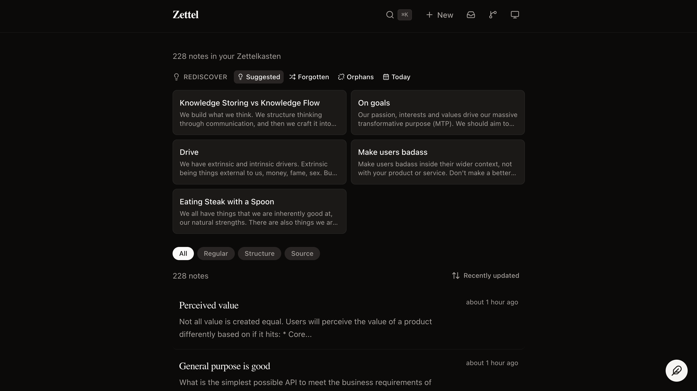

# Zettel-Web

A self-hostable Zettelkasten knowledge management app with AI-powered
semantic search and automated content generation. Capture notes from
the web, email, or Telegram, find connections between ideas using
meaning-based search, and automatically generate blog posts and social
media drafts from your knowledge graph.

Built with ASP.NET Core, React, PostgreSQL + pgvector, and your choice
of OpenAI, Ollama, or Amazon Bedrock.



---

## Table of Contents

- [Features](#features)
- [Deployment Options](#deployment-options)
  - [Option 1: Docker Compose (self-hosted)](#option-1-docker-compose-self-hosted)
  - [Option 2: AWS Serverless (Terraform)](#option-2-aws-serverless-terraform)
- [Configuration](#configuration)
  - [Required](#required)
  - [Embedding Provider](#embedding-provider)
  - [Content Generation (LLM)](#content-generation-llm)
  - [Content Generation Schedule](#content-generation-schedule)
  - [Telegram Notifications](#telegram-notifications-optional)
  - [Publishing](#publishing-optional)
  - [Research Agent](#research-agent-optional)
  - [Optional: Fleeting Note Capture](#optional-fleeting-note-capture)
  - [Optional: Observability](#optional-observability)
  - [Search Tuning](#search-tuning)
- [Webhook Ingestion (AWS SQS)](#webhook-ingestion-aws-sqs)
- [Architecture](#architecture)
- [API Reference](#api-reference)
- [Running Tests](#running-tests)
- [Project Structure](#project-structure)
- [License](#license)

---

## Features

- **Semantic search** — Find notes by meaning using vector embeddings,
  with hybrid mode that combines full-text and semantic ranking
- **Zettelkasten workflow** — Permanent notes, fleeting notes (quick
  capture), structure notes (for organizing), and source notes (with
  bibliography metadata)
- **Multiple capture methods** — Web UI, email (via AWS SES), or
  Telegram bot
- **Knowledge graph** — Visual graph of note relationships and
  backlinks
- **Backlinks** — Wiki-style `[[Title]]` linking between notes with
  automatic backlink detection
- **Related notes** — AI-powered discovery of semantically similar
  notes and duplicate detection
- **URL enrichment** — Automatically fetches and extracts metadata from
  URLs found in notes
- **Import/export** — Import Notion-compatible markdown; export all
  notes as a ZIP with YAML front matter
- **Version history** — Tracks snapshots of note changes
- **Tag system** — Full-text autocomplete and filtering
- **Health monitoring** — `/health` endpoint with database and
  embedding API status
- **OpenTelemetry** — Built-in tracing and metrics instrumentation
- **Graceful degradation** — Falls back to full-text search if the
  embedding API is unavailable
- **Automated content generation** — Independently scheduled pipeline
  that mines your knowledge graph: blog posts on a weekly cadence,
  social media drafts daily, both generated in your voice for human
  review before publishing
- **Autonomous research agent** — Analyses KB gaps and rich clusters,
  generates targeted search queries, fetches from Brave Search and
  Arxiv, synthesises findings with an LLM instruction barrier, and
  queues results as fleeting notes for inbox triage

---

## Deployment Options

There are two supported deployment paths. Choose based on your needs:

| | Docker Compose | AWS Serverless |
|---|---|---|
| Infrastructure | Single server / VPS | AWS Lambda + Aurora + CloudFront |
| Cost | Fixed server cost | ~$13/month (pay-per-use) |
| Setup time | 5 minutes | ~30 minutes |
| Public URL | Manual (reverse proxy) | Yes (API Gateway + CloudFront) |
| Authentication | None (add your own reverse proxy auth) | Cognito (included) |
| Scales to zero | No | Yes |
| Best for | LAN / private home lab | Personal, always-accessible |

---

### Option 1: Docker Compose (self-hosted)

The fastest way to run the full stack. Requires only Docker.

#### Quick Start

**1. Clone and configure**

```bash
git clone https://github.com/jameseastham/zettel-system.git
cd zettel-system
cp docker-compose.example.yml docker-compose.yml
```

Edit `docker-compose.yml` with your settings (see [Configuration](#configuration)
below). At minimum, choose an embedding provider.

**2. Start everything**

```bash
docker compose up -d
```

This starts four services behind Traefik on port 9010:

| Service    | Description                                                 |
| ---------- | ----------------------------------------------------------- |
| `traefik`  | Reverse proxy routing `/api/*` to backend, `/*` to frontend |
| `backend`  | ASP.NET Core API (port 8080 internal)                       |
| `frontend` | React SPA                                                   |
| `db`       | PostgreSQL 16 with pgvector                                 |

The app is available at `http://localhost:9010`. The database is
persisted in `./data/postgres`.

**3. Verify**

```bash
curl http://localhost:9010/health
```

Should return `{"status":"Healthy",...}`.

#### Pre-Built Container Images

Container images are published to GitHub Container Registry on every
push to `main`:

```
ghcr.io/jameseastham/zettel-system/backend:latest
ghcr.io/jameseastham/zettel-system/frontend:latest
```

Tags available: `latest` (main branch), `sha-<commit>`, and semantic
versions (`v1.0.0`).

#### Building from Source

Requires [.NET 10 SDK](https://dot.net/download) and
[Node.js](https://nodejs.org/).

For local development with just the database:

```bash
docker compose -f docker-compose.dev.yml up -d  # starts PostgreSQL 16 on localhost:5432
dotnet run --project src/ZettelWeb
```

In a separate terminal for the frontend:

```bash
cd src/zettel-web-ui
npm install
npm run dev
```

---

### Option 2: AWS Serverless (Terraform)

Deploys the application to AWS as a fully serverless stack using Lambda,
Aurora Serverless v2, CloudFront, and Cognito. No server to maintain, and
costs are roughly ~$13/month at personal usage.

```
Browser → Cognito Hosted UI (login)
        → CloudFront → API Gateway → Lambda (ASP.NET Core)
                                          ↓
                               Aurora Serverless v2 (PostgreSQL + pgvector)
                               Bedrock (embeddings + content generation)
EventBridge → EmbeddingWorker Lambda  (every 60s)
EventBridge → ContentSchedule Lambda  (blog: weekly, social: daily)
SQS         → CaptureWorker Lambda    (email / Telegram capture)
```

#### Prerequisites

- [AWS CLI](https://aws.amazon.com/cli/) configured with an account
- [Terraform](https://developer.hashicorp.com/terraform/install) ≥ 1.7
- AWS Bedrock model access enabled for:
  - `amazon.titan-embed-text-v2:0` (embeddings)
  - `anthropic.claude-3-5-sonnet-20241022-v2:0` (content generation)

#### Step 1 — Bootstrap the Terraform state backend

Terraform stores its state in an S3 bucket with a DynamoDB lock table.
Create these once manually before the first `terraform apply`:

```bash
# Replace <your-account-id> and choose a region
aws s3api create-bucket \
  --bucket zettel-terraform-state \
  --region eu-west-1 \
  --create-bucket-configuration LocationConstraint=eu-west-1

aws s3api put-bucket-versioning \
  --bucket zettel-terraform-state \
  --versioning-configuration Status=Enabled

aws dynamodb create-table \
  --table-name zettel-terraform-locks \
  --attribute-definitions AttributeName=LockID,AttributeType=S \
  --key-schema AttributeName=LockID,KeyType=HASH \
  --billing-mode PAY_PER_REQUEST \
  --region eu-west-1
```

#### Step 2 — Configure variables

```bash
cd terraform/environments/prod
cp terraform.tfvars.example terraform.tfvars
```

Edit `terraform.tfvars` with your values. The minimum required fields:

```hcl
db_master_password = "choose-a-strong-password"
alert_email        = "you@example.com"
image_tag          = "latest"   # CI overrides this with the git SHA
```

`terraform.tfvars` is gitignored and must never be committed.

#### Step 3 — Deploy infrastructure

```bash
terraform init
terraform apply
```

The first apply takes approximately 10–15 minutes (Aurora cluster
provisioning is the longest step). At the end, Terraform prints the
outputs you need for the next steps:

```
cloudfront_domain     = "https://d1234abcdef.cloudfront.net"
api_gateway_url       = "https://abc123.execute-api.eu-west-1.amazonaws.com"
ecr_backend_url       = "123456789.dkr.ecr.eu-west-1.amazonaws.com/zettel/backend"
cognito_user_pool_id  = "eu-west-1_AbCdEfGhI"
cognito_client_id     = "1a2b3c4d5e6f7g8h9i0j"
cognito_domain        = "https://zettel-abc123.auth.eu-west-1.amazoncognito.com"
```

#### Step 4 — Set GitHub Actions secrets

After the first `terraform apply`, configure the repository secrets so
CI/CD can push backend images to ECR:

```bash
# Get the IAM role ARN for OIDC-based CI/CD authentication
terraform output github_actions_role_arn
```

In your GitHub repository, set:

| Secret / Variable | Value | Where to set |
|---|---|---|
| `AWS_ROLE_ARN` | Output of `github_actions_role_arn` | Repository secret |
| `ECR_REPOSITORY_URL` | Output of `ecr_backend_url` | Repository variable |

The `build-and-push-ecr` job in the CI workflow uses OIDC to assume
this role — no long-lived AWS access keys are stored in GitHub.

#### Step 5 — Create your user account

Authentication is admin-only (no self-registration). Create your single
user with the AWS CLI:

```bash
POOL_ID=$(terraform output -raw cognito_user_pool_id)

aws cognito-idp admin-create-user \
  --user-pool-id "$POOL_ID" \
  --username you@example.com \
  --temporary-password "Temp123!" \
  --message-action SUPPRESS

aws cognito-idp admin-set-user-password \
  --user-pool-id "$POOL_ID" \
  --username you@example.com \
  --password "YourRealPassword123!" \
  --permanent
```

#### Step 6 — Deploy the frontend

The React frontend is deployed as static files to S3 + CloudFront.
After the first CI run pushes a backend image, build and sync the frontend:

```bash
cd src/zettel-web-ui

# Set the Cognito values from terraform outputs
VITE_API_URL=$(cd ../../terraform/environments/prod && terraform output -raw api_gateway_url) \
VITE_COGNITO_CLIENT_ID=$(cd ../../terraform/environments/prod && terraform output -raw cognito_client_id) \
VITE_COGNITO_DOMAIN=$(cd ../../terraform/environments/prod && terraform output -raw cognito_domain) \
npm run build

# Sync to S3 and invalidate CloudFront
BUCKET=$(cd ../../terraform/environments/prod && terraform output -raw s3_bucket_name)
DIST_ID=$(cd ../../terraform/environments/prod && terraform output -raw cloudfront_distribution_id)

aws s3 sync dist/ "s3://$BUCKET/" --delete
aws cloudfront create-invalidation --distribution-id "$DIST_ID" --paths "/*"
```

After this, navigate to the `cloudfront_domain` output URL, log in with
your Cognito credentials, and the app is live.

#### Updating the application

On every push to `main`, GitHub Actions automatically:

1. Runs all tests
2. Pushes the backend image to both GHCR (for Docker Compose users) and ECR
3. Runs `MigrationLambda` via `terraform apply` to apply any new migrations
4. Updates the API Lambda with the new image

To deploy manually:

```bash
# Push a new image to ECR (CI does this automatically)
aws ecr get-login-password --region eu-west-1 | docker login ...

# Apply infrastructure changes and re-invoke the migration Lambda
cd terraform/environments/prod
terraform apply -var="image_tag=<new-git-sha>"
```

The frontend must be re-deployed separately after a Vite build whenever
the frontend source changes (it is not included in the Lambda image).

#### Cost breakdown

At personal usage (~100 API requests/day):

| Resource | Monthly cost |
|---|---|
| Lambda (API + workers) | ~$0 (within free tier) |
| API Gateway HTTP API | ~$0 (within free tier) |
| Aurora Serverless v2 (0.5 ACU min) | ~$4 |
| VPC endpoints × 6 | ~$7 |
| S3 + CloudFront | ~$1 |
| Cognito (< 50,000 MAU) | $0 |
| CloudWatch logs + alarms | ~$1 |
| **Total** | **~$13/month** |

#### Aurora scaling note

Aurora is configured with `min_capacity = 0.5` ACU (not zero). Setting
min to zero would enable true scale-to-zero, but resuming from 0 ACU
takes 15–30 seconds — enough to make the first page load feel broken.
At 0.5 ACU, Aurora stays warm at ~$4/month and all requests respond normally.

---

## Configuration

All configuration is via environment variables (or `appsettings.json`
for local development). In Docker Compose, variables are set in the
`docker-compose.yml` file. In AWS, they are stored in a single Secrets
Manager secret and loaded automatically by the Lambda functions.

### Required

| Variable                               | Description                                                        |
| -------------------------------------- | ------------------------------------------------------------------ |
| `ConnectionStrings__DefaultConnection` | PostgreSQL connection string. Set automatically by docker-compose. |

### Embedding Provider

Choose between OpenAI (cloud), Ollama (local, free), or Amazon Bedrock.

#### Option A: Ollama (default, no API key needed)

Run [Ollama](https://ollama.ai) locally and pull a model:

```bash
ollama pull nomic-embed-text
```

```bash
EMBEDDING_PROVIDER=ollama
EMBEDDING_MODEL=nomic-embed-text
EMBEDDING_OLLAMA_URL=http://host.docker.internal:11434
```

If running Ollama on the same machine as Docker, the default
`host.docker.internal` URL works on macOS/Windows. On Linux, use
`http://172.17.0.1:11434` or add `--network=host`.

#### Option B: OpenAI

```bash
EMBEDDING_PROVIDER=openai
EMBEDDING_MODEL=text-embedding-3-large
EMBEDDING_API_KEY=sk-...
```

#### Option C: Amazon Bedrock

```bash
EMBEDDING_PROVIDER=bedrock
EMBEDDING_MODEL=amazon.titan-embed-text-v2:0
EMBEDDING_DIMENSIONS=1024
# Uses ambient AWS credentials (IAM role in AWS; access keys in Docker Compose)
AWS_ACCESS_KEY_ID=...
AWS_SECRET_ACCESS_KEY=...
```

#### All Embedding Options

| Variable                        | Default                  | Description                          |
| ------------------------------- | ------------------------ | ------------------------------------ |
| `Embedding__Provider`           | `ollama`                 | `openai`, `ollama`, or `bedrock`     |
| `Embedding__Model`              | `nomic-embed-text`       | Model name                           |
| `Embedding__Dimensions`         | `768`                    | Vector dimensions (must match model) |
| `Embedding__ApiKey`             | (empty)                  | OpenAI API key                       |
| `Embedding__OllamaUrl`          | `http://localhost:11434` | Ollama endpoint                      |
| `Embedding__MaxInputCharacters` | `4000`                   | Max text length before truncation    |
| `Embedding__MaxRetries`         | `3`                      | Retry count for failed embeddings    |

### Content Generation (LLM)

Content generation uses a separate chat/completion LLM, independent of
the embedding provider. It generates blog posts and social media drafts
from your notes.

#### Option A: OpenAI

```bash
CONTENTGENERATION__PROVIDER=openai
CONTENTGENERATION__MODEL=gpt-4o
CONTENTGENERATION__APIKEY=sk-...
```

#### Option B: Amazon Bedrock

```bash
CONTENTGENERATION__PROVIDER=bedrock
CONTENTGENERATION__MODEL=anthropic.claude-3-5-sonnet-20241022-v2:0
CONTENTGENERATION__REGION=us-east-1
```

Bedrock uses the ambient AWS credentials from the environment
(`AWS_ACCESS_KEY_ID` / `AWS_SECRET_ACCESS_KEY` or an IAM role).

#### All Content Generation Options

| Variable                               | Default    | Description                                         |
| -------------------------------------- | ---------- | --------------------------------------------------- |
| `ContentGeneration__Provider`          | `openai`   | `openai` or `bedrock`                               |
| `ContentGeneration__Model`             | `gpt-4o`   | Model identifier                                    |
| `ContentGeneration__ApiKey`            | (required) | API key — OpenAI only                               |
| `ContentGeneration__Region`            | (empty)    | AWS region — Bedrock only                           |
| `ContentGeneration__MaxTokens`         | `4096`     | Max output tokens per generation call               |
| `ContentGeneration__Temperature`       | `0.7`      | Sampling temperature                                |
| `ContentGeneration__MaxClusterSize`    | `10`       | Max notes included in a topic cluster               |
| `ContentGeneration__MinClusterSize`    | `3`        | Min notes required; triggers retry if not met       |
| `ContentGeneration__MaxSeedRetries`    | `3`        | Max seed selection retries for thin topics          |
| `ContentGeneration__SemanticThreshold` | `0.75`     | Cosine similarity threshold for related notes       |
| `ContentGeneration__SocialPostCount`   | `3`        | Number of social posts generated per scheduled run  |

### Content Generation Schedule

Blog posts and social media drafts run on **independent schedules** —
both are disabled by default. Enable each separately (UTC times).

#### Blog posts (weekly)

```bash
ContentGeneration__Schedule__Blog__Enabled=true
ContentGeneration__Schedule__Blog__DayOfWeek=Monday
ContentGeneration__Schedule__Blog__TimeOfDay=09:00
```

| Variable                                        | Default  | Description                              |
| ----------------------------------------------- | -------- | ---------------------------------------- |
| `ContentGeneration__Schedule__Blog__Enabled`    | `false`  | Set to `true` to enable weekly blog runs |
| `ContentGeneration__Schedule__Blog__DayOfWeek`  | `Monday` | Day to run (`Monday`–`Sunday`)           |
| `ContentGeneration__Schedule__Blog__TimeOfDay`  | `09:00`  | Time to run in UTC (`HH:mm`)             |

#### Social posts (daily)

```bash
ContentGeneration__Schedule__Social__Enabled=true
ContentGeneration__Schedule__Social__TimeOfDay=09:00
```

| Variable                                          | Default | Description                               |
| ------------------------------------------------- | ------- | ----------------------------------------- |
| `ContentGeneration__Schedule__Social__Enabled`    | `false` | Set to `true` to enable daily social runs |
| `ContentGeneration__Schedule__Social__TimeOfDay`  | `09:00` | Time to run in UTC (`HH:mm`)              |

In the AWS deployment, the schedule is managed by EventBridge rules.
Create two separate rules pointing to the `ContentSchedule` Lambda —
one with input `{"Medium":"blog"}` on a weekly cron and one with
`{"Medium":"social"}` on a daily cron. The
`ContentGeneration__Schedule__*` environment variables are not used
in the AWS deployment.

Generation can also be triggered manually at any time via
`POST /api/content/generate`.

### Publishing (optional)

Once a piece has been approved in Content Review, it can be sent to a
publishing destination as a draft. Each medium has its own service:

- **Blog posts** → GitHub repository (creates an Astro-compatible
  markdown file in your content directory as a draft)
- **Social posts** → Publer (creates a scheduled draft post)

Both services are optional and independently configured.

#### Blog posts → GitHub

```bash
Publishing__GitHub__Token=ghp_...
Publishing__GitHub__Owner=your-github-username
Publishing__GitHub__Repo=your-blog-repo
```

| Variable                          | Default            | Description                                        |
| --------------------------------- | ------------------ | -------------------------------------------------- |
| `Publishing__GitHub__Token`       | (required)         | GitHub personal access token with `contents:write` |
| `Publishing__GitHub__Owner`       | (required)         | GitHub username or organisation                    |
| `Publishing__GitHub__Repo`        | (required)         | Repository name                                    |
| `Publishing__GitHub__Branch`      | `main`             | Branch to commit the draft file to                 |
| `Publishing__GitHub__ContentPath` | `src/content/blog` | Path within the repo where `.md` files are written |
| `Publishing__GitHub__Author`      | `James Eastham`    | `author:` field in the generated YAML front matter |

Files are written as `{ContentPath}/{date}-{slug}-{id[:8]}.md` with
Astro-compatible YAML front matter (`draft: true`, `pubDatetime`,
`title`, `description`, `tags`).

#### Social posts → Publer

```bash
Publishing__Publer__ApiKey=publer_api_...
Publishing__Publer__Accounts__0__Id=123456
Publishing__Publer__Accounts__0__Platform=linkedin
```

| Variable                                    | Default     | Description                                              |
| ------------------------------------------- | ----------- | -------------------------------------------------------- |
| `Publishing__Publer__ApiKey`                | (required)  | Publer API key (Settings → API in your Publer workspace) |
| `Publishing__Publer__Accounts__0__Id`       | (required)  | Publer account ID for the first social account           |
| `Publishing__Publer__Accounts__0__Platform` | `linkedin`  | Platform key: `linkedin`, `twitter`, `bluesky`, etc.    |

Add more accounts by incrementing the index: `Publishing__Publer__Accounts__1__Id`, etc.

### Research Agent (optional)

The autonomous research agent analyses your knowledge base, generates
targeted search queries, and queues findings for your review. It requires
a [Brave Search API key](https://brave.com/search/api/) for web search;
Arxiv search requires no key.

```bash
Research__BraveSearch__ApiKey=BSA...
```

The agent is triggered manually from the Knowledge Health dashboard or
via `POST /api/research/trigger`. Findings appear at `/research` in the
UI for accept (→ fleeting note) or dismiss.

| Variable                              | Default | Description                                                          |
| ------------------------------------- | ------- | -------------------------------------------------------------------- |
| `Research__BraveSearch__ApiKey`       | (empty) | Brave Search API key. Web search is skipped if empty.                |
| `Research__MaxFindingsPerRun`         | `5`     | Maximum findings created per research run                            |
| `Research__DeduplicationThreshold`   | `0.85`  | Cosine similarity threshold — results above this are skipped as near-duplicates of existing notes |

The agent reuses the same `ContentGeneration` LLM provider for agenda
generation and synthesis. No additional LLM configuration is needed.

### Optional: Fleeting Note Capture

Capture quick notes from email or Telegram. Requires the SQS capture
infrastructure (see [Webhook Ingestion](#webhook-ingestion-aws-sqs)).

| Variable                              | Description                     |
| ------------------------------------- | ------------------------------- |
| `Capture__SqsQueueUrl`                | AWS SQS queue URL               |
| `Capture__SqsRegion`                  | AWS region of the SQS queue     |
| `AWS_ACCESS_KEY_ID`                   | AWS credentials for SQS polling |
| `AWS_SECRET_ACCESS_KEY`               | AWS credentials for SQS polling |
| `Capture__AllowedEmailSenders__0`     | Whitelisted email sender        |
| `Capture__AllowedTelegramChatIds__0`  | Whitelisted Telegram chat ID    |
| `Capture__TelegramBotToken`           | Telegram bot API token          |

> **Note:** `Capture__TelegramBotToken` also enables outbound
> [Telegram notifications](#telegram-notifications-optional). No
> additional token is needed.

### Telegram Notifications (optional)

When `Capture__TelegramBotToken` is set, the app sends outbound
notifications back to every chat ID in `Capture__AllowedTelegramChatIds`.
No extra configuration is required — the same bot token is reused.

**Notification events:**

| Event | Message sent |
|---|---|
| Blog scheduler completes | `📝 1 blog post ready for review.` |
| Social scheduler completes | `📱 3 social posts ready for review.` |
| Scheduler skipped (no eligible notes) | `⚠️ Scheduled generation skipped: no eligible notes for topic discovery.` |
| Scheduler run fails | `❌ Scheduled blog/social generation failed. Check logs for details.` |
| Telegram capture received | `✅ Note saved.` (reply to the sender's chat) |

Notifications are **best-effort**: if the Telegram API is unavailable
the failure is logged at `Warning` level and the primary operation
(generation or capture) is unaffected. When the bot token is absent a
no-op notifier is registered automatically — no null-checks or
conditional code required elsewhere.

To receive notifications without enabling capture, set
`Capture__TelegramBotToken` and add at least one chat ID to
`Capture__AllowedTelegramChatIds`.

### Optional: Observability

| Variable         | Description                                                          |
| ---------------- | -------------------------------------------------------------------- |
| `Otel__Endpoint` | OpenTelemetry collector endpoint (e.g. `http://otel-collector:4317`) |

### Search Tuning

| Variable                    | Default | Description                                  |
| --------------------------- | ------- | -------------------------------------------- |
| `Search__SemanticWeight`    | `0.7`   | Weight for semantic scores in hybrid search  |
| `Search__FullTextWeight`    | `0.3`   | Weight for full-text scores in hybrid search |
| `Search__MinimumSimilarity` | `0.5`   | Minimum cosine similarity threshold          |

---

## Webhook Ingestion (AWS SQS)

To capture notes from email (via AWS SES) or Telegram on a server
without a public IP, deploy the optional SQS relay stack in `infra/`.

This creates:
- API Gateway HTTP endpoint for Telegram webhooks
- Lambda relay function (Telegram → SQS)
- SES receipt rule for inbound email → SQS
- Dead-letter queue with CloudWatch alarms

```bash
cd infra
npm install
npx cdk deploy
```

Once deployed, set the `Capture__SqsQueueUrl` environment variable in
your app to enable the SQS polling background service.

In the AWS serverless deployment, the SQS queue wires directly to a
Lambda function via event source mapping — no long-polling background
service is needed.

---

## Architecture

### Docker Compose

```
┌─────────┐     ┌──────────┐     ┌──────────────────┐
│ React   │────▶│ Traefik  │────▶│ ASP.NET Core API │
│ Frontend│     │ (proxy)  │     │                  │
└─────────┘     └──────────┘     │ Controllers      │
                                 │ Services         │
                                 │ Background       │
                                 │  Workers         │
                                 └────────┬─────────┘
                                          │
                    ┌─────────────────────┼──────────────────┐
                    │                     │                  │
               ┌────▼─────┐    ┌─────────▼──┐   ┌──────────▼──────┐
               │PostgreSQL │    │ Embedding  │   │ Chat LLM        │
               │+ pgvector │    │ (OpenAI /  │   │ (OpenAI/Bedrock)│
               └───────────┘    │  Ollama /  │   │ content gen     │
                                │  Bedrock)  │   └─────────────────┘
                                └────────────┘
```

### AWS Serverless

```
Browser → Cognito Hosted UI (login) → access token
        → CloudFront
              └──▶ API Gateway HTTP API
                        │ JWT Authorizer (validates Cognito token)
                        └──▶ Lambda (ASP.NET Core + Lambda Web Adapter)
                                  │
                    ┌─────────────┼─────────────────┐
                    │             │                  │
              ┌─────▼──────┐   ┌─▼──────────┐   ┌──▼──────────────┐
              │Aurora SV2  │   │Bedrock     │   │Secrets Manager  │
              │PostgreSQL  │   │Embeddings  │   │(all config)     │
              │+ pgvector  │   │+ Claude    │   └─────────────────┘
              └────────────┘   └────────────┘

EventBridge (60s) ──▶ EmbeddingWorker Lambda
EventBridge (cron) ─▶ ContentSchedule Lambda
SQS event source ───▶ CaptureWorker Lambda
Terraform apply ────▶ Migration Lambda (once per deploy)
```

The backend runs three background workers in Docker Compose (in-process)
and three separate Lambda functions in the AWS deployment. The service
logic is identical in both cases — only the hosting differs.

---

## API Reference

### Notes

| Method   | Endpoint                        | Description                                 |
| -------- | ------------------------------- | ------------------------------------------- |
| `POST`   | `/api/notes`                    | Create a note                               |
| `GET`    | `/api/notes`                    | List notes (supports pagination, filtering) |
| `GET`    | `/api/notes/{id}`               | Get a note by ID                            |
| `PUT`    | `/api/notes/{id}`               | Update a note                               |
| `DELETE` | `/api/notes/{id}`               | Delete a note                               |
| `POST`   | `/api/notes/check-duplicate`    | Check for duplicate content                 |
| `POST`   | `/api/notes/re-embed`           | Re-embed all notes                          |
| `GET`    | `/api/notes/{id}/backlinks`     | Get wiki-style backlinks                    |
| `GET`    | `/api/notes/{id}/versions`      | Get version history                         |
| `POST`   | `/api/notes/{id}/promote`       | Convert fleeting to permanent               |
| `POST`   | `/api/notes/{fleetingId}/merge` | Merge fleeting into permanent               |

### Search

| Method | Endpoint                              | Description              |
| ------ | ------------------------------------- | ------------------------ |
| `GET`  | `/api/search?q={query}`               | Hybrid search (default)  |
| `GET`  | `/api/search?q={query}&type=fulltext` | Full-text only           |
| `GET`  | `/api/search?q={query}&type=semantic` | Semantic only            |
| `GET`  | `/api/search/{noteId}/related`        | Find related notes       |
| `GET`  | `/api/search/discover`                | Discover unrelated notes |

### Import / Export

| Method | Endpoint      | Description                        |
| ------ | ------------- | ---------------------------------- |
| `POST` | `/api/import` | Import markdown files (JSON array) |
| `GET`  | `/api/export` | Download all notes as ZIP          |

### Content Generation

| Method   | Endpoint                                 | Description                                             |
| -------- | ---------------------------------------- | ------------------------------------------------------- |
| `POST`   | `/api/content/generate`                  | Trigger a manual generation run                         |
| `GET`    | `/api/content/generations`               | List generation runs (paginated)                        |
| `GET`    | `/api/content/generations/{id}`          | Get a run with its content pieces                       |
| `GET`    | `/api/content/pieces`                    | List pieces (filter by `medium`, `status`)              |
| `GET`    | `/api/content/pieces/{id}`               | Get a single piece                                      |
| `PUT`    | `/api/content/pieces/{id}/approve`       | Approve a piece                                         |
| `PUT`    | `/api/content/pieces/{id}/reject`        | Reject a piece                                          |
| `POST`   | `/api/content/pieces/{id}/send-to-draft` | Send approved piece to GitHub (blog) or Publer (social) |
| `GET`    | `/api/content/pieces/{id}/export`        | Download piece as a `.md` file                          |
| `PUT`    | `/api/content/pieces/{id}/description`   | Update piece description                                |
| `PUT`    | `/api/content/pieces/{id}/tags`          | Update piece tags                                       |
| `GET`    | `/api/content/schedule`                  | Get per-type schedule settings (blog + social)          |
| `PUT`    | `/api/content/schedule/blog`             | Update blog schedule settings                           |
| `PUT`    | `/api/content/schedule/social`           | Update social schedule settings                         |

### Voice Configuration

| Method   | Endpoint                   | Description                          |
| -------- | -------------------------- | ------------------------------------ |
| `GET`    | `/api/voice/examples`      | List writing examples                |
| `POST`   | `/api/voice/examples`      | Add a writing example                |
| `DELETE` | `/api/voice/examples/{id}` | Delete a writing example             |
| `GET`    | `/api/voice/config`        | Get style notes (filter by `medium`) |
| `PUT`    | `/api/voice/config`        | Set style notes for a medium (upsert)|

### Knowledge Base Health

| Method | Endpoint                                 | Description                                    |
| ------ | ---------------------------------------- | ---------------------------------------------- |
| `GET`  | `/api/kb-health/overview`                | Scorecard, orphans, clusters, unused seeds     |
| `GET`  | `/api/kb-health/orphan/{id}/suggestions` | Semantic connection suggestions for an orphan  |
| `POST` | `/api/kb-health/orphan/{id}/link`        | Insert a `[[wikilink]]` into an orphan note    |

### Research Agent

| Method | Endpoint                                      | Description                                                           |
| ------ | --------------------------------------------- | --------------------------------------------------------------------- |
| `POST` | `/api/research/trigger`                       | Analyse KB and generate a research agenda (returns agenda for review) |
| `POST` | `/api/research/agenda/{agendaId}/approve`     | Approve agenda and start execution (202 — runs in background)         |
| `GET`  | `/api/research/findings`                      | List pending findings awaiting review                                 |
| `POST` | `/api/research/findings/{findingId}/accept`   | Accept a finding — creates a fleeting note                            |
| `POST` | `/api/research/findings/{findingId}/dismiss`  | Dismiss a finding                                                     |

### Other

| Method | Endpoint                | Description          |
| ------ | ----------------------- | -------------------- |
| `GET`  | `/api/tags?q={prefix}`  | Autocomplete tags    |
| `GET`  | `/api/graph`            | Knowledge graph data |
| `GET`  | `/api/discovery/random` | Random notes         |
| `GET`  | `/health`               | Service health check |

---

## Running Tests

```bash
dotnet test
```

Unit tests use in-memory databases and require no external services.
Integration tests spin up a real PostgreSQL container via
[Testcontainers](https://testcontainers.com/) — Docker must be running.

---

## Project Structure

```
zettel-system/
  src/
    ZettelWeb/           # ASP.NET Core Web API
      Lambda/            # Lambda handler entry points (AWS deployment)
    ZettelWeb.Tests/     # xUnit test project
    zettel-web-ui/       # React frontend (Vite + Tailwind)
  terraform/             # AWS infrastructure (Terraform)
    modules/             # Reusable modules: networking, database, auth, api, workers, frontend
    environments/prod/   # Production environment entry point
  infra/                 # AWS CDK — optional SQS webhook ingestion stack
  docs/                  # Design docs, ADRs, compound knowledge docs
  docker-compose.example.yml  # Full stack (Traefik + backend + frontend + DB)
  docker-compose.dev.yml      # Dev database only (PostgreSQL 16 + pgvector)
```

---

## License

MIT
